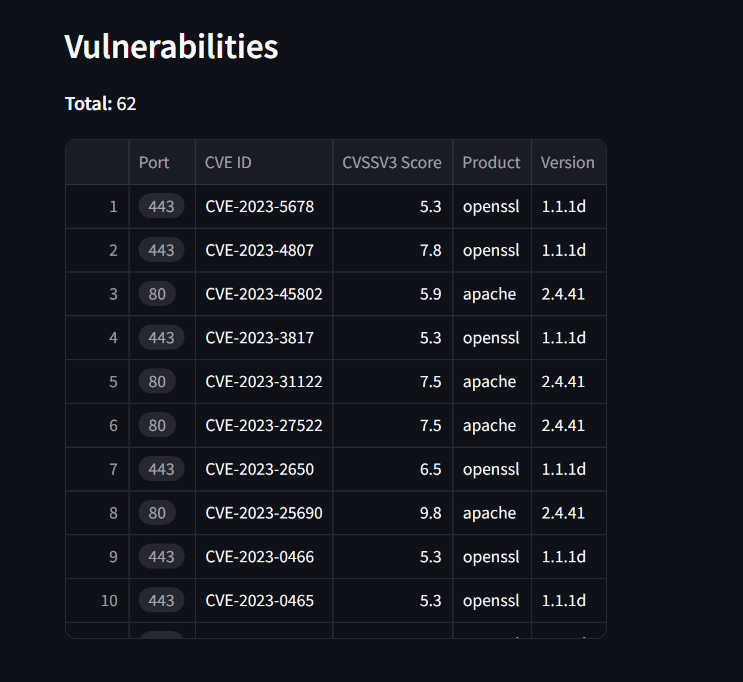

# Criminal IP Vulnerability Scanner

This is a Python-based **Vulnerability Scanner** using the `Criminal IP API` to gather and display information about a specified IP address. It provides details such as **Location**, **ISP**, **VPN**, **Inbound** and **Outbound** scores, **Open Ports**, **Serivices** Information and **Vulnerabilities**.


## Example Output

**Summary:**


**Open Ports:**


**Vulnerabilites:**




## Features

- Fetch and display IP address details
- Retrieve and show location information
- Show ISP and VPN usage status
- Display inbound and outbound security scores
- List open ports and associated services
- Display vulnerabilities associated with the IP address


## Installation

To get started with this project, clone the repository and install the required dependencies.

1. Clone the repository:

   ```bash
   git clone https://github.com/mrguanjo/criminal-ip-vuln-scanner.git
   cd criminal-ip-vuln-scanner
   ```
2. Install the dependencies:

	`pip install -r requirements.txt`

3. Create a `.env` file in the root directory and add your Criminal IP API key:

	`API_KEY=your_api_key`


## Usage

To run the application, execute the following command:

`streamlit run criminal-ip-vuln-scanner.py`

This will start a local web server, and you can access the application by navigating to http://localhost:8501 in your web browser.


## Disclaimer

This tool is intended for educational purposes and lawful use only. Use this tool responsibly.

Unauthorized access to systems, data theft, or any form of misuse is strictly prohibited and may result in severe legal consequences. By using this tool, you agree to take full responsibility for your actions and comply with all applicable laws and regulations.

## Acknowledgements

- [Criminal IP](https://www.criminalip.io/) for providing the API used in this project.
- [Streamlit](https://streamlit.io/) for the web application framework.
